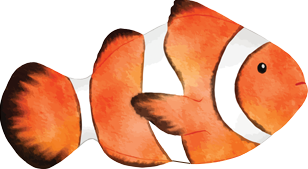
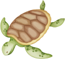
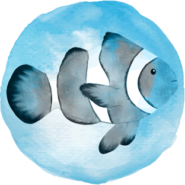

[](https://classroom.github.com/a/X0i5xhqP)
<div id="top"></div>
<!-- PROJECT LOGO -->
<br />
<div align="center">


<h3 align="center">AngryFlappyBird</h3>


 <p align="center">
   A JavaFx Application inspired by Flappy Bird
   <br />
   By Claudia Gonzalez-Vazquez, Lynn Do and Mina Kocer-Bowman
   <br />
   <a href="https://drive.google.com/file/d/1wlvciuJ39jDjNVYVJryjJ2DT0mGC3sJs/view?usp=sharing">View Demo</a>
   ·
   <a href="https://github.com/MHC-FA23-CS225/angryflappybird-teamcat/issues">Report Bug</a>
   ·
   <a href="https://github.com/MHC-FA23-CS225/angryflappybird-teamcat/issues">Request Feature</a>
 </p>
</div>


<!-- TABLE OF CONTENTS -->
<details>
 <summary>Table of Contents</summary>
 <ol>
   <li><a href="#game-components">Game Components</a></li>
   <li>
     <a href="#features">Features</a>
     <ul>
       <li><a href="#basic-features">Basic Features</a></li>
       <li><a href="#bonus-features">Bonus Features</a></li>
     </ul>
   </li>
   <li>
     <a href="#getting-started">Getting Started</a>
     <ul>
       <li><a href="#prerequisites">Prerequisites</a></li>
       <li><a href="#installation">Installation</a></li>
     </ul>
   </li>
   <li>
     <a href="#contact">Contact</a>
   </li>
 </ol>
</details>
<p align="right">(<a href="#top">back to top</a>)</p>

<!-- Features -->
## Game Components

|                                                                | Object           |                                                                  | Object        |                                                               | Object |
|:--------------------------------------------------------------:|------------------|------------------------------------------------------------------|---------------|---------------------------------------------------------------|--------|
|        | Fish             |         | Turtle        |      | Floor  |
|  | Fish (autopilot) |   | Normal pearl  |  | Pipes  |
|                                                                |                  |  | Special pearl |                                                               |        |                                                               |        |

<p align="right">(<a href="#top">back to top</a>)</p>

<!-- Features -->
## Features

### Basic Features
- [x] Fish avoids all obstacles (pipes, floors and turtles). If collision with these happens, then 1 life is lost.
    - [x] Fish bounces back when collides with an obstacle.
- [x] Pearls appear randomly on the lower pipes.
    - [x] If the fish hits the pink pearl, then 1 point is added.
    - [x] If the fish hits the yellow pearl, then allow 6 seconds of snooze mode (autonomously avoiding the obstacles while still adding score)
- [x] Turtles drop randomly from the upper pipes and can collect the pearls.
    - [x] If the turtle collects the pearls before the fish, 1 point is lost.
- [x] Background changes from day to night periodically.
- [x] UI panel
    - [x] A button that controls the start of the game and the wing flap of the bird. 
    - [x] Difficulty selection 
    - [x] Icon with text description of the normal, special pearls and turtle
- [x] Keep track of score and lives. If all 3 lives are lost, reset the score and lives. 
- [x] Difficulty levels implementation for 3 levels (Hard, Medium, Easy).

### Bonus Features
- [x] Sound effects for various events
- [x] Fish avoids obstacles during snooze mode
- [x] Fish orientation changes when swimming vs. when dropping

<p align="right">(<a href="#top">back to top</a>)</p>

## Getting started

### Prerequisites

* [Eclipse](https://eclipseide.org/)
* [JavaFx](https://gluonhq.com/products/javafx/)

**Note**: Make sure to store the downloaded JavaFx folder in somewhere that is easier to access!

<p align="right">(<a href="#top">back to top</a>)</p>

### Installation
1. Clone the repo
 
  ```sh
  git clone https://github.com/MHC-FA23-CS225/angryflappybird-teamcat
  ```
 
2. Import the project to Eclipse

3. Import JavaFX to the project

- Right click on the project 
- Select ```Build Path``` 
- Select ```Configure Build Path```
- Click on ```Classpath```
- Click on ```Add Library```
- Select ```User Library``` 
- Check ```JavaFX[version]``` and click ```Finish```
- Click ```Apply and Close```

3. Run the application

- Right click on the project
- Select `Run As` then select `Run configurations`
- Open the `Arguments` tab, and in the VM arguments field, paste the following:

    ```sh
    --module-path "[path to javafx folder]/lib" --add-modules "javafx.base,javafx.controls,javafx.media"
    ```

    where ```[path to javafx folder]``` is where you store your JavaFx folder

**Note**: Make sure that the box ```Use the -XstartOnFirstThread argument when launching with SWT``` is not checked!

- Click `Run`

4. Run the JUnit tests

In the `Arguments` tab of the test files (stored in the ```tests``` folder), in the VM arguments field, paste the same line as with the main application.

**Note**: Make sure that the JUnit library is imported to the project!

<p align="right">(<a href="#top">back to top</a>)</p>

<!-- CONTACT -->
## Contact

* Claudia Gonzalez-Vazquez (gonza32c@mtholyoke.edu)

* Lynn Do (do24l@mtholyoke.edu)

* Mina Kocer-Bowman (kocer22a@mtholyoke.edu)


<p align="right">(<a href="#top">back to top</a>)</p>